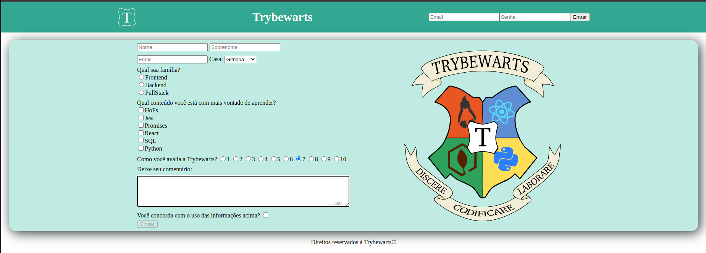

# Trybewarts Wizarding School Project!

## Description

Project developed during the Trybe software development course.
In this project, a Trybewarts School of Magic form page was developed, where student can submit their feedback about it. The theme of this project is based on the work 'Harry Potter', by J.K. Rowling. The images were provided by Trybe.

## Tools

- HTML5;
- CSS3;
- Javascript ES6.

# Skills Developed

* Create HTML forms;
* Use CSS Flexbox to create flexible layouts;
* Create specific CSS rules to be applied to mobile devices;
* Build pages that change their layout according to screen orientation;
